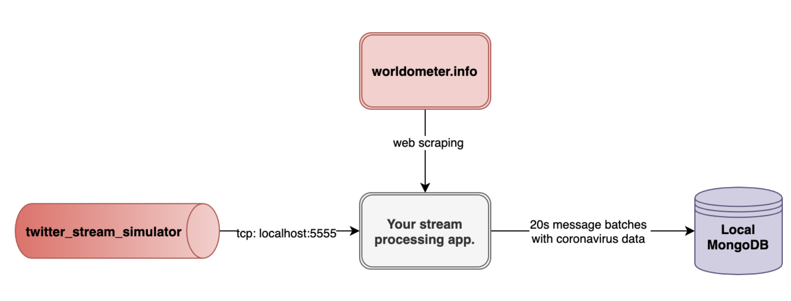

# Ultimate - Data Engineer Coding Challenge 

### Brief 

The coronavirus affected most industries on a global scale and created an excessive workload on customer support departments. To maintain customer support quality, most companies started to adopt automated customer support solutions like Ultimate. 


Based on new coronavirus-like worldwide events, our data scientists are working on a new regression model for predicting the number of potential customers. To this end, they need the live tweets from Twitter and the number of total coronavirus cases from worldometer.info. 


As a data engineer, your task is creating a Python (preferably v3.9) application that processes Twitter’s live tweet stream, fetches total coronavirus cases from worldometer.info, merges tweet and coronavirus data, and finally, loads merged data into a MongoDB instance. 

### Implementation Notes / Requirements 

- To simulate the Twitter stream, we provide a sample python script 
(twitter_stream_simulator.py) to you, it publishes random text messages over localhost:5555 via TCP. You can either directly use the provided script to simulate Twitter stream or create your own Twitter stream reader. 
- The tweet stream should be processed by a stream processing framework such as Beam, Storm, Samza, Spark Streaming, etc. 
- In case you use the provided Twitter stream simulator script, your app should listen to localhost:5555 TCP stream and process the incoming messages. 
- During tweet processing; ‘#’, ‘RT:’ characters and URLs should be removed from messages.
- Incoming messages should be buffered/accumulated in batches for every 20 seconds.
- For each message batch, the latest Coronavirus cases should be fetched from https://www.worldometers.info/coronavirus/ . You may take the advantages, beautifulsoup4 (https://pypi.org/project/beautifulsoup4/) python library for web scraping. 
- For each message batch, the merged content (as follows) should be stored in a MongoDB database.
```json
    { 
        "content": list_of_processed_tweets_in_current_batch, 
        "timestamp": timestamp, 
        "total_case_count": total_case_count 
    }
```
- You can create a MongoDB instance on your local machine by running the following docker run command, in default configuration it accepts all connections without needing authentication: 
`docker run -p 27027:27027 mongo:4.0.0`
- The system architecture should be similar to that, but feel free to be creative. 



### Evaluation 

- **Scenario fitness:** How does your solution meet the requirements? 
- **Modularity:** Can your code easily be modified? How much effort is needed to add new data sources and preprocessing steps to it? 
- **Code readability and comments:** Is your code easily comprehensible?
- **Bonus:** Any additional creative features.
